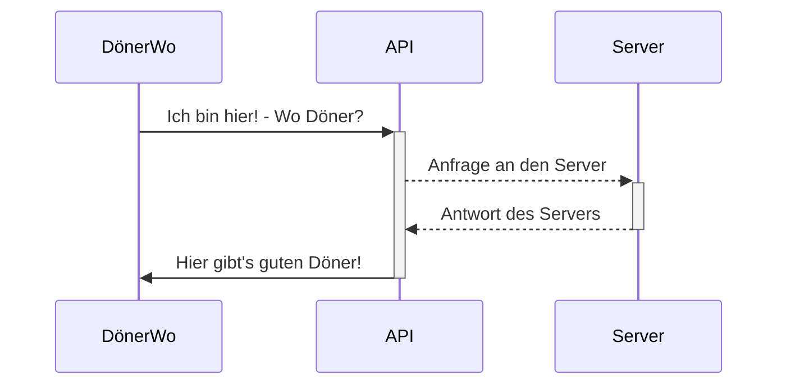

# Willkommen bei der DönerWo Dokumentation!

Hi! **DönerWo** ist dein Retter in Not!
Schon mal richtig Bock auf einen geilen Döner gehabt, aber du wusstest nicht wo sich der nächste gute Döner finden lässt? Dann bist Du hier genau richtig!

# Was macht DönerWo?

Die Applikation sucht anhand deines Standortes den nächsten (guten) Döner in deiner Nähe! 
Du kannst auch eine Bewertung hinterlassen ob du den Döner richtig gut oder richtig schlecht findest, um die auszusortieren, die Du nicht wieder besuchen willst.

## Verwendete Technologien

**Programmiersprache:** Java

**Persistenz:** MongoDB

**API:** MapBox

## Teammitglieder

**Gaurlual Hothi**
**Leonard Roland**
**Mihael Petrovic**
**Nenad Neskovic**

## Vorteile von DönerWo

Warum Du dir **DönerWo** gönnen solltest:

|         Mit DönerWo       |Ohne DönerWo                          |
|---------------- | -----------------------------|
|Einfach Fragen|Planlos            |
|Schnell lecker Döner          |Verloren und Hungrig            |
|Von App in der Hand - Zu Döner in der Hand          |leere Hände|

## Wie funktioniert das?!

DönerWo übernimmt für Dich das denken und fragt seinen Habibi einfach!

